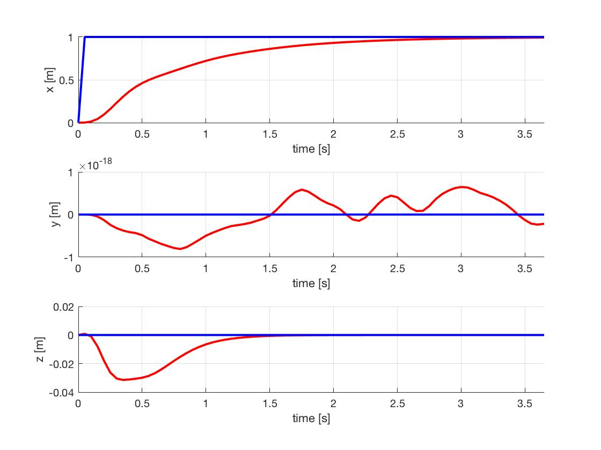
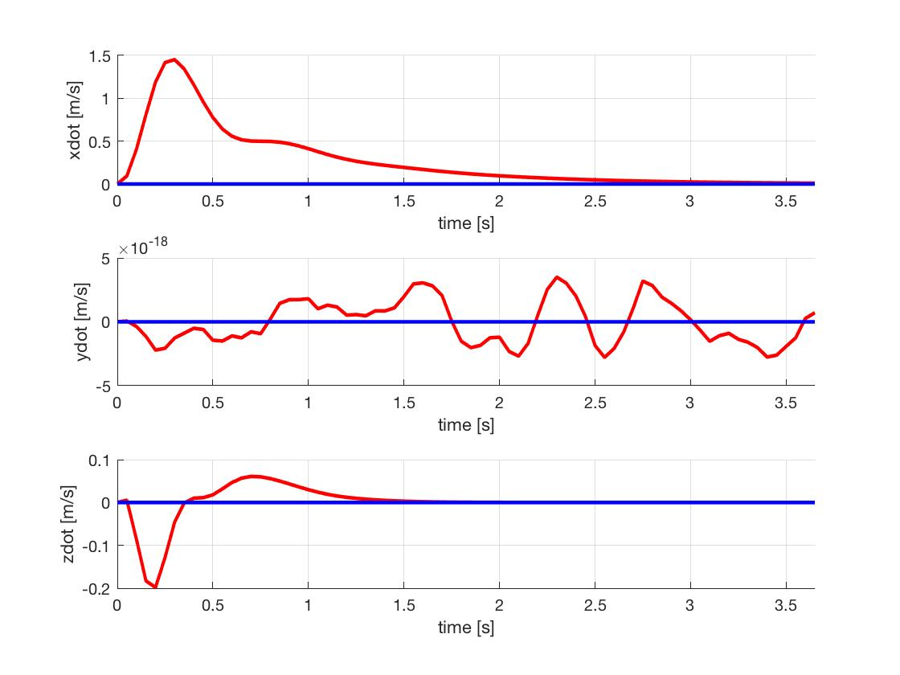
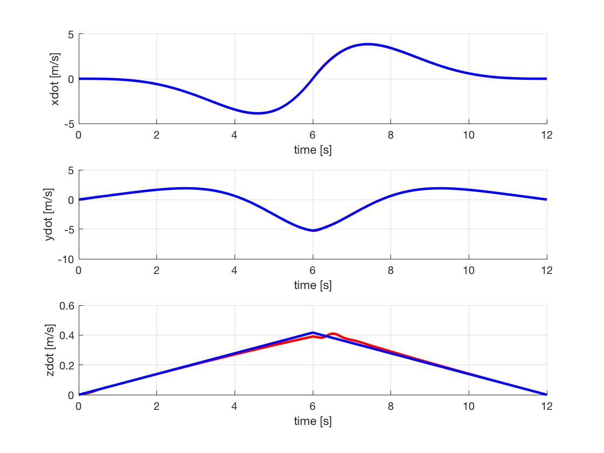
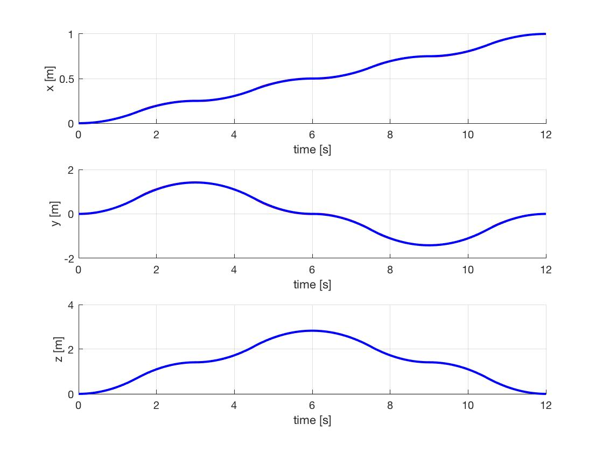

## Quadrotor Control, Path Planning and Trajectory Generation

Following MEAM 620 Advanced Robotics course at University of Pennsylvania.

## PD Controller

- See [quadrotor_dynamics.pdf](quadrotor_dynamics.pdf) for dynamic modeling of the quadrotor.
- Change trajectories in file `runsim.m` and run.
   
#### Trajectory 1: Step

- Desired (blue) vs Actual (red):

 

#### Trajectory 2: Circle

- Desired (blue) vs Actual (red):

 

#### Trajectory 2: Diamond

- Desired (blue) vs Actual (red):

 