## Quadrotor Control, Path Planning and Trajectory Optimization
<a href="https://youtu.be/lA2B1YDLJaY">
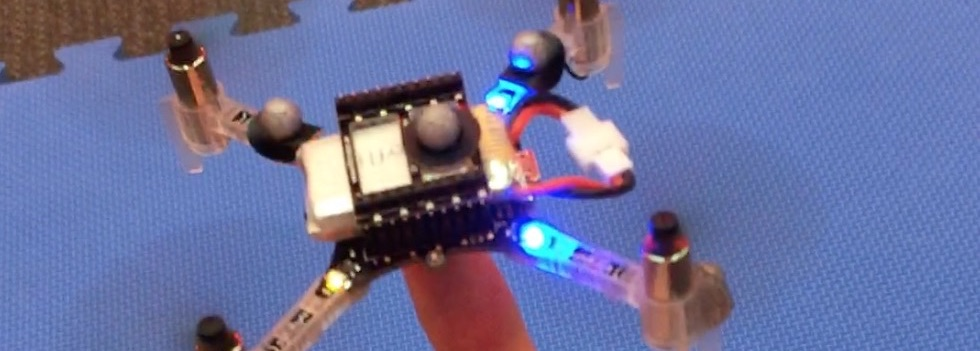
</a>

(Click above image for real quadrotor demos)

Following [MEAM 620 Advanced Robotics](https://alliance.seas.upenn.edu/~meam620/wiki/) course at University of Pennsylvania. 

This repo includes matlab code for:
- Quadrotor PD controller
- Path planning algorithms (Dijkstra, A*)
- Trajectory optimizations (Minimum Snap/Acceleration Trajectory)

## PD Controller

- Run code: change trajectories in file `control/runsim.m` and run.
- See [quadrotor_dynamics.pdf](quadrotor_dynamics.pdf) for dynamic modeling of the quadrotor.
- See `control/controller.m` for implementation of the PD controller.
- Visualization below. Desired (blue) vs Actual (red)

#### Trajectory 1: Step

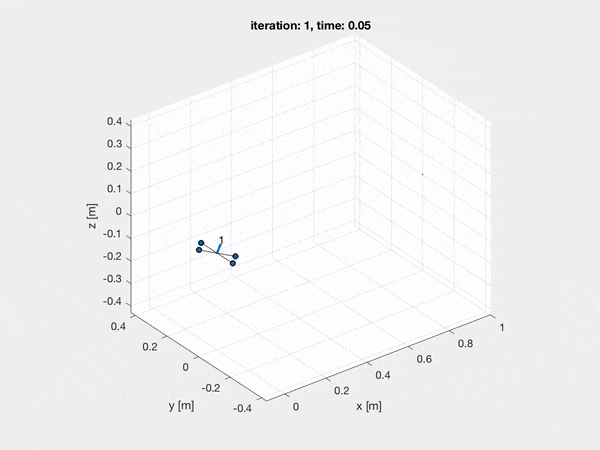  

#### Trajectory 2: Circle

 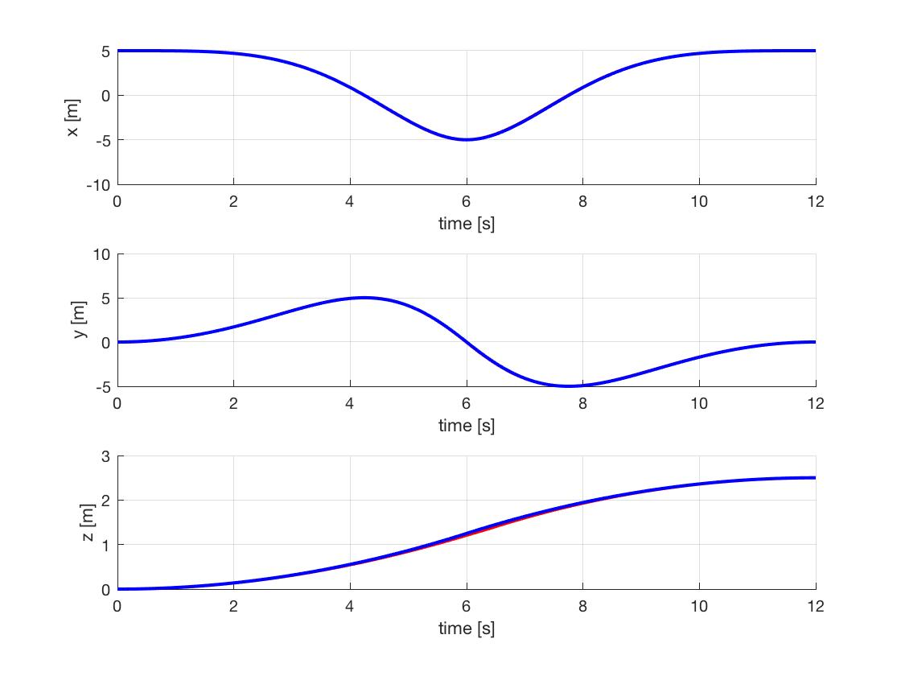 

#### Trajectory 2: Diamond

  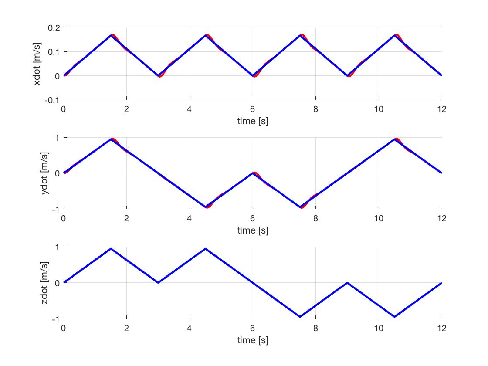

## Path Planning and Trajectory Optimization

- Run code: `traj_planning/runsim.m` and run path 1 or path 3.
- See [project_report.pdf](project_report.pdf) for more details about trajectory generation
- See `traj_planning/path_planning/dijkstra.m` for implementation of path finding algorithms (dijstra, A*).
- See `traj_planning/traj_opt7.m` for implementations of minimium snap trajectory.
- See `traj_planning/traj_opt5.m` for implementations of minimium acceleration trajectory.
- Visualization below.

#### Minimum Acceleration Trajectory

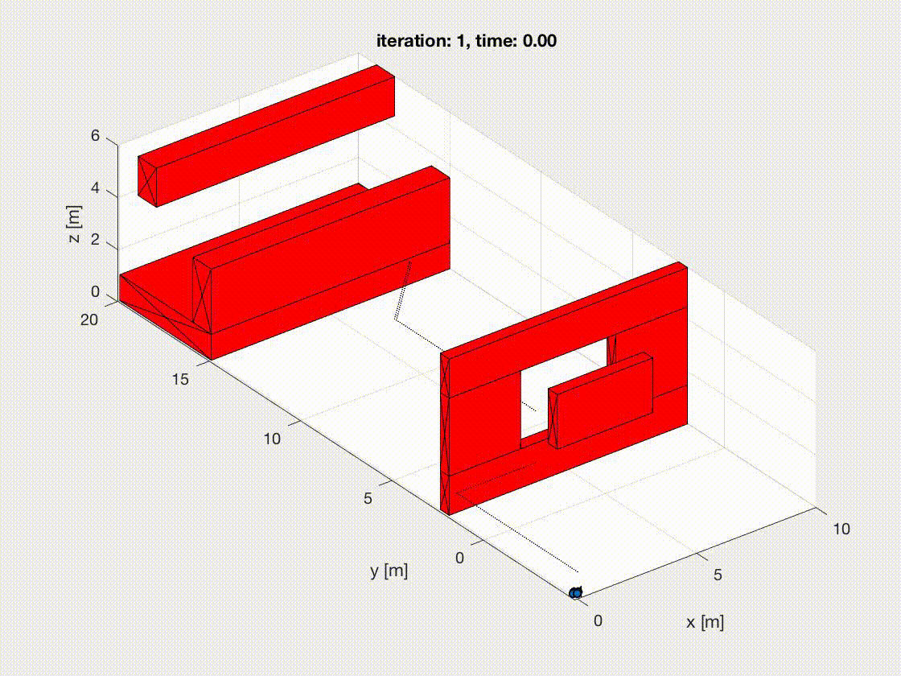 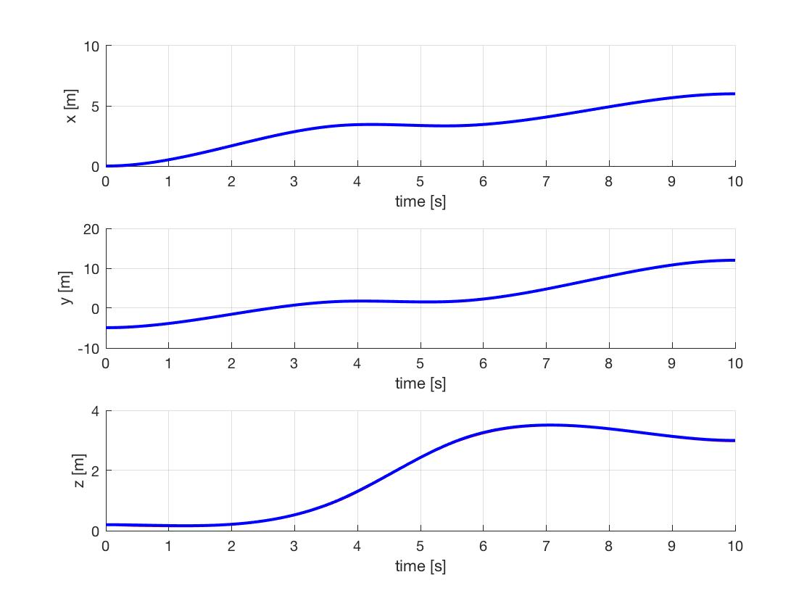 

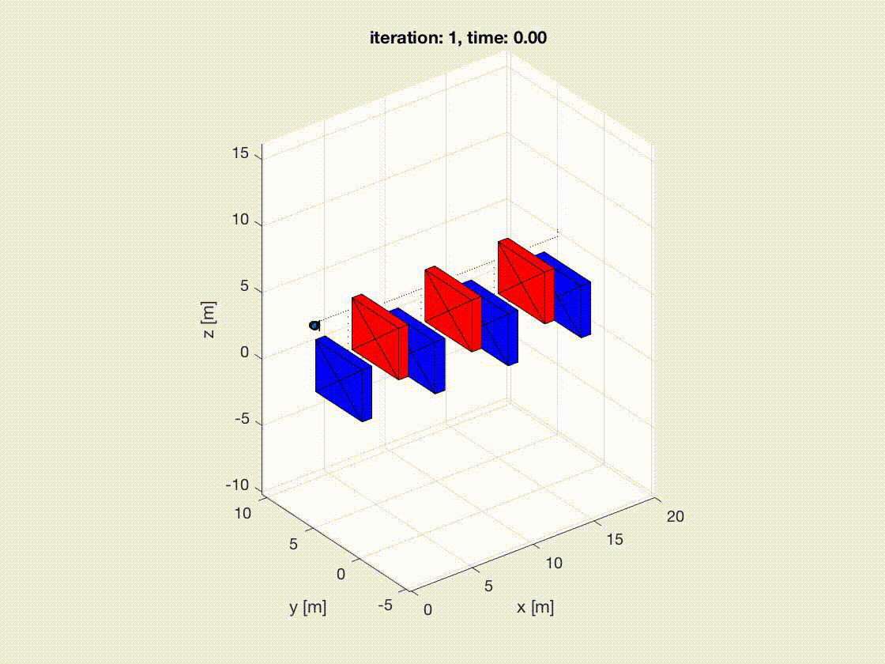 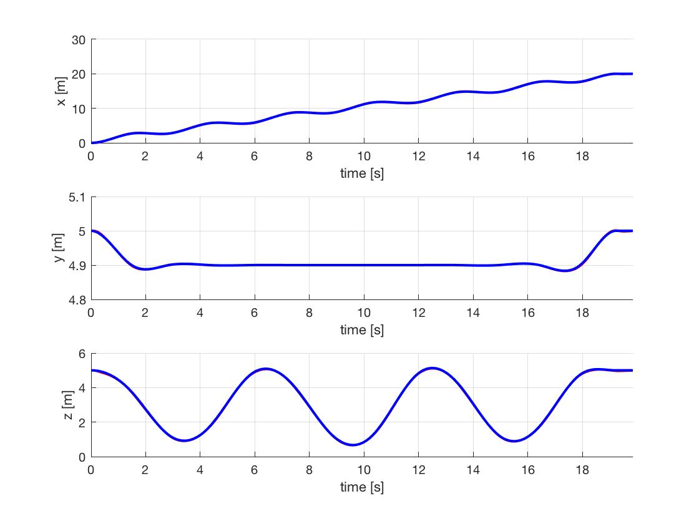 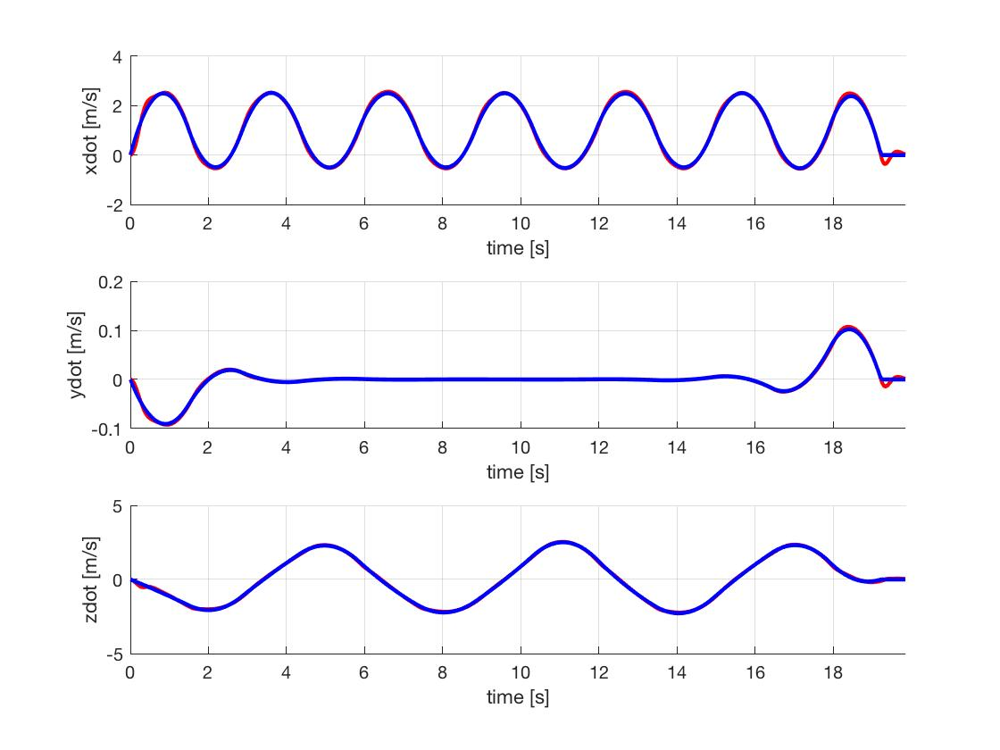

#### Minimum Snap Trajectory

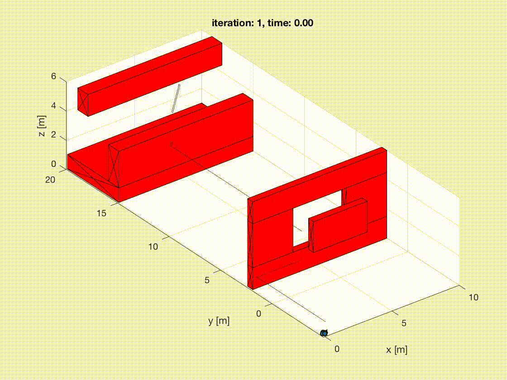 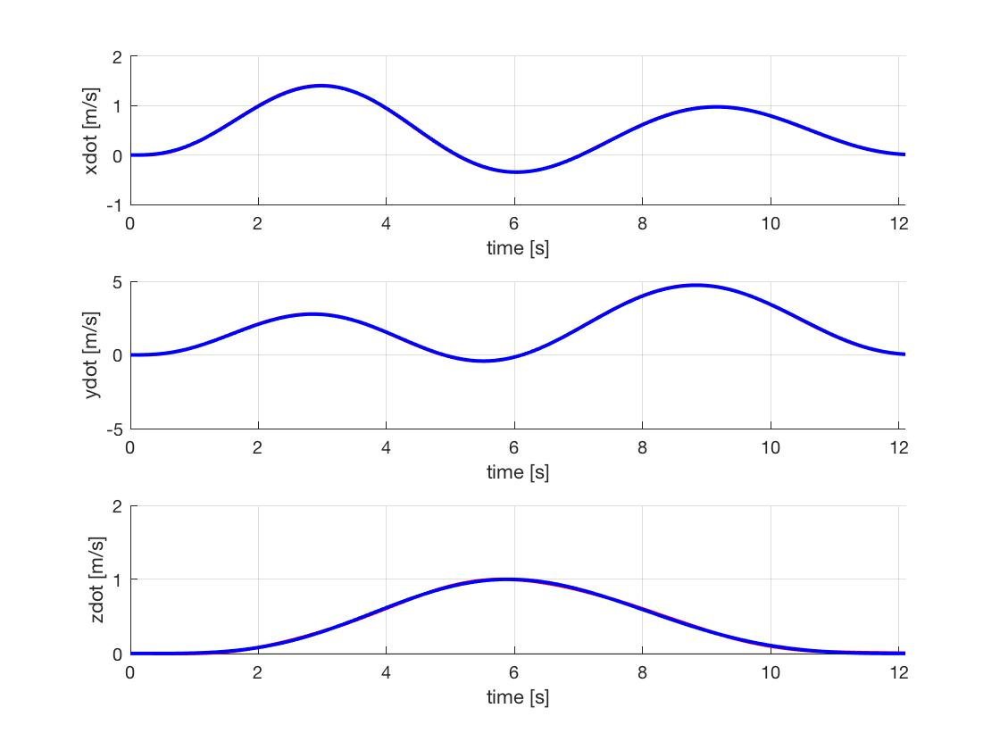 

(with way points constraints)

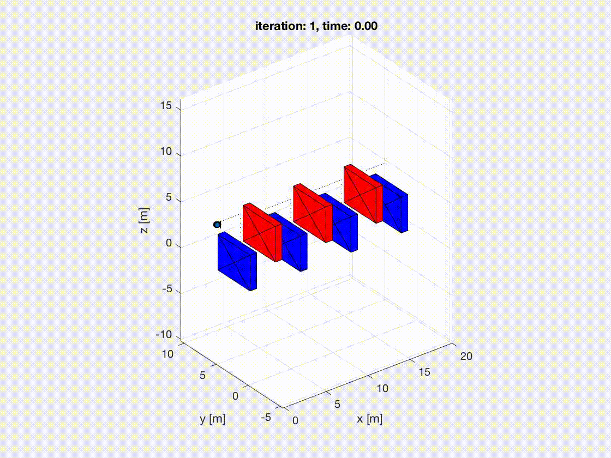  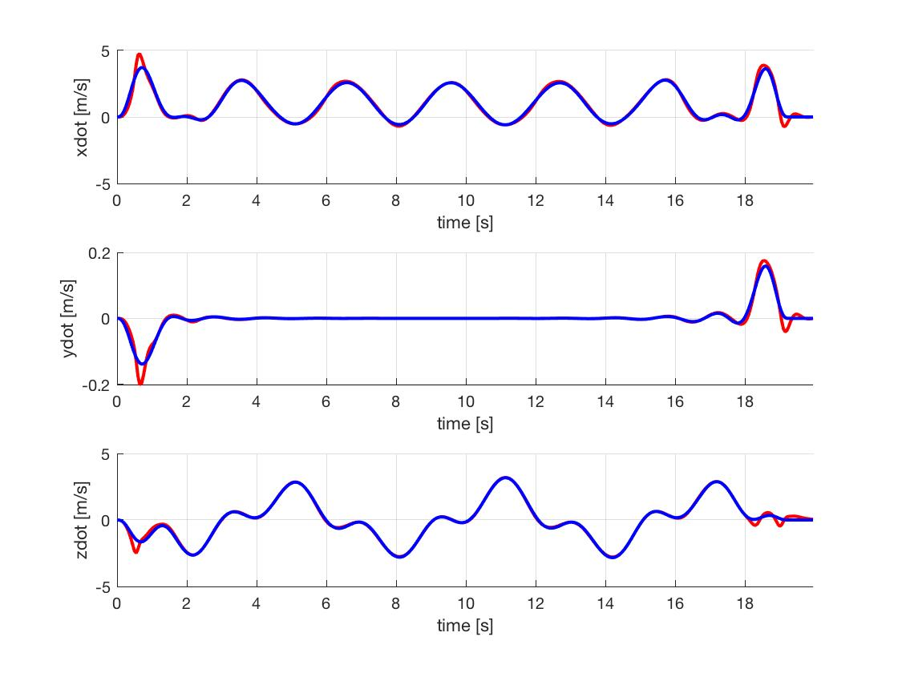
